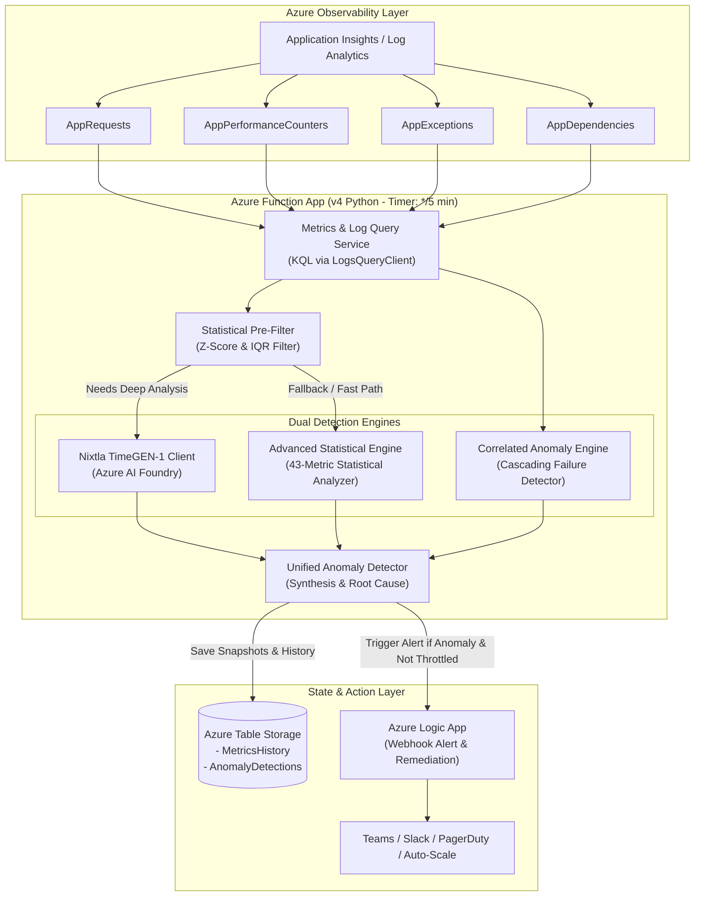

# Azure AI Anomaly Pre-Detection System (TimeGEN-1 & Statistical Hybrid)

[](https://learn.microsoft.com/en-us/azure/azure-functions/)
[](https://ai.azure.com/)
[](https://learn.microsoft.com/en-us/azure/azure-monitor/)
[](https://www.python.org/)
[](LICENSE)

An enterprise-grade **AI Anomaly Pre-Detection & Early Warning System** deployed as a serverless Azure Function. The system proactively detects anomalies across application logs and infrastructure metrics **5 to 10 minutes before** failures manifest as critical performance spikes or customer-facing outages.

Built using a hybrid architecture that integrates **Nixtla TimeGEN-1 / TimeGPT foundation models** hosted on Azure AI Foundry with a sub-second **Advanced Statistical Anomaly Engine (Z-Score, IQR, Rolling Baselines)**, **Cross-Metric Correlation Detection**, **Azure Table Storage State Tracking**, and **Azure Logic Apps Automated Remediation**.

---

## 📑 Table of Contents

- [Executive Overview](#-executive-overview)
- [Key Features](#-key-features)
- [System Architecture](#-system-architecture)
- [Detection Pipeline Workflow](#-detection-pipeline-workflow)
- [TimeGEN-1 Integration & Multi-Series API](#-timegen-1-integration--multi-series-api)
- [Monitored Metrics & KQL Catalog](#-monitored-metrics--kql-catalog)
- [Statistical Analysis Engine (43 Metrics)](#-statistical-analysis-engine-43-metrics)
- [Repository Structure](#-repository-structure)
- [Prerequisites & Environment Configuration](#-prerequisites--environment-configuration)
- [Local Development & Testing](#-local-development--testing)
- [Azure Deployment](#-azure-deployment)
- [Logic App Alert Schema](#-logic-app-alert-schema)
- [Performance & Benchmark Insights](#-performance--benchmark-insights)
- [Troubleshooting & Resilience Features](#-troubleshooting--resilience-features)
- [Contributing & License](#-contributing--license)

---

## 🎯 Executive Overview

Traditional observability tools trigger reactive alerts only *after* fixed thresholds are breached (e.g., CPU > 85% or HTTP 5xx > 50). By then, users are already impacted.

This system solves this challenge through **pre-detection**:
1. **Pre-Metric Log Analysis**: Detects error cascades, database connection pool exhaustion, and authentication spikes inside application logs before infrastructure metrics degrade.
2. **Multi-Series Time Series Intelligence**: Simultaneously analyzes interconnected metrics (CPU, Memory, Request Latency, Exceptions, Thread Counts) to detect abnormal co-movement and cascading failures.
3. **Hybrid Failover Architecture**: Seamlessly falls back to an ultra-fast statistical engine (0.01s evaluation across 43 metrics) if model endpoints experience high latency or cold starts.
4. **Intelligent Alert Throttling**: Preserves state in Azure Table Storage to suppress duplicate alerts within 15-minute rolling windows.

---

## ✨ Key Features

- **🕒 Serverless Scheduled Execution**: Azure Functions v4 timer trigger (`AnomalyTSPocTimer`) running automatically every 5 minutes.
- **🤖 Nixtla TimeGEN-1 / TimeGPT Integration**: Utilizes dedicated time-series foundation models on Azure AI Foundry (`/anomaly_detection_multi_series`, `/v2/online_anomaly_detection`).
- **⚡ High-Performance Statistical Fallback**: Robust dual-layer statistical anomaly detection combining dynamic Z-score calculations ($|Z| > 2.5$), Interquartile Range (IQR $1.5\times$), and rolling trend baselines.
- **🔗 Cross-Metric Correlation**: Pearson correlation analysis identifying cascading failures (e.g., memory leak leading to garbage collection pauses and request timeouts).
- **📋 Log & Metric Unification**: KQL queries to Azure Log Analytics workspaces joining `AppRequests`, `AppPerformanceCounters`, `AppExceptions`, and `AppDependencies`.
- **💾 Historical State Management**: Maintains metrics snapshots and detection history in Azure Table Storage (`MetricsHistory` and `AnomalyDetections`).
- **🔕 Alert Storm Suppression**: State-aware deduplication suppressing repeated notifications within a 15-minute window.
- **🚀 Automated Remediation & Notifications**: Triggers Azure Logic App webhooks with detailed diagnostic payloads for Teams/Slack messaging and automated recovery.
- **🛡️ Multi-Strategy Import Resilience**: Built-in fallback loader supporting standard package paths, `sys.path` injection, dynamic module loading, and mock fallbacks.

---

## 🏗️ System Architecture



---

## 🔄 Detection Pipeline Workflow

Every 5 minutes, the execution pipeline runs through the following sequence:

```
[1. KQL Query] ──────► [2. Statistical Extraction] ──► [3. State Snapshot]
Query last 25 mins       Compute 43 statistical metrics  Persist snapshot to
(with 5-min ingestion)   (mean, std, IQR, percentiles)   Azure Table Storage
                                                                │
                                                                ▼
[6. Alert & Remediate] ◄─── [5. TimeGEN-1 / Hybrid] ◄─── [4. Pre-Filter & Correlation]
Check duplicate state       Execute Multi-Series AI      Filter normal metrics,
Send Logic App webhook      or instant statistical fallback compute cross-metric correlation
```

1. **Metrics & Logs Extraction (KQL)**: Queries the Azure Log Analytics workspace for the preceding 25 minutes (20-minute analysis window + 5-minute Application Insights ingestion buffer).
2. **Statistical Profiling**: Calculates central tendencies (mean, median, mode), dispersion (variance, std, IQR, MAD), distributions (skewness, kurtosis), and extremes (min, max, percentiles P10-P99).
3. **State Snapshot**: Persists the calculated metrics snapshot into the `MetricsHistory` table in Azure Table Storage.
4. **Pre-Filtering & Correlation**: Evaluates metrics against dynamic Z-score thresholds to eliminate noise and runs correlation detection across metric pairs.
5. **Multi-Series AI Anomaly Detection**: Sends active time-series data to Nixtla TimeGEN-1 on Azure AI Foundry. If the AI endpoint times out or errors, the statistical engine instantaneously processes the batch.
6. **Deduplication & Notification**: Inspects `AnomalyDetections` in Table Storage. If no alert for the metric was dispatched in the last 15 minutes, an enriched payload is posted to Azure Logic Apps.

---

## 🤖 TimeGEN-1 Integration & Multi-Series API

The system integrates with **Nixtla TimeGEN-1 / TimeGPT** deployed on Azure AI Foundry.

### Correct Multi-Series Payload Format

```json
{
  "series": [
    {
      "unique_id": "cpu_usage",
      "ds": [
        "2025-11-06T10:00:00Z",
        "2025-11-06T10:01:00Z",
        "2025-11-06T10:02:00Z",
        "2025-11-06T10:03:00Z",
        "2025-11-06T10:04:00Z"
      ],
      "y": [45.2, 47.1, 52.3, 78.1, 49.2]
    },
    {
      "unique_id": "memory_available",
      "ds": [
        "2025-11-06T10:00:00Z",
        "2025-11-06T10:01:00Z",
        "2025-11-06T10:02:00Z",
        "2025-11-06T10:03:00Z",
        "2025-11-06T10:04:00Z"
      ],
      "y": [2147483648, 2147483648, 1879048192, 536870912, 1982827192]
    }
  ],
  "detection_size": 5,
  "h": 3
}
```

### Discovered Swagger Endpoints Summary

| Endpoint | Method | Purpose | Status in Production |
| :--- | :---: | :--- | :---: |
| `/info` | `GET` | Service & Model Information | ✅ Active |
| `/validate_token` | `POST` | Bearer Token Validation | ✅ Active |
| `/listRoutes` | `GET` | List all available API endpoints | ✅ Active |
| `/anomaly_detection_multi_series` | `POST` | Multi-series time-series anomaly detection | ⚡ Primary AI Path |
| `/v2/online_anomaly_detection` | `POST` | Real-time online anomaly detection | ⚡ Alternate AI Path |
| `/v2/forecast` | `POST` | Multi-horizon metric forecasting | 🔮 Forecasting Path |

> 💡 **Production Resilience**: In case of Azure AI Foundry model timeouts or service cold starts, `shared/production_timegen_client.py` activates the statistical fallback engine automatically without failing the detection cycle.

---

## 📊 Monitored Metrics & KQL Catalog

The system extracts and analyzes 16+ telemetry streams from Azure Monitor Log Analytics:

| Category | Metric Identifier | Source KQL Table | Unit | Description |
| :--- | :--- | :--- | :--- | :--- |
| **Requests** | `request_count` | `AppRequests` | `count/min` | Total incoming HTTP request volume |
| **Requests** | `request_duration` | `AppRequests` | `ms` | Average request response time |
| **Requests** | `request_failed` | `AppRequests` | `count` | Unaggregated failed request events |
| **Performance** | `cpu_usage` | `AppPerformanceCounters` | `%` | Processor utilization |
| **Performance** | `memory_available` | `AppPerformanceCounters` | `bytes` | Free available physical memory |
| **Performance** | `process_cpu` | `AppPerformanceCounters` | `%` | Normalized process CPU usage |
| **Performance** | `process_memory` | `AppPerformanceCounters` | `bytes` | Private bytes allocated by process |
| **Performance** | `thread_count` | `AppPerformanceCounters` | `count` | Active execution threads |
| **Performance** | `handle_count` | `AppPerformanceCounters` | `count` | Open OS handles (resource leak indicator) |
| **Performance** | `gc_gen0_collections` | `AppPerformanceCounters` | `count` | Generation 0 garbage collections |
| **Performance** | `gc_gen1_collections` | `AppPerformanceCounters` | `count` | Generation 1 garbage collections |
| **Performance** | `gc_gen2_collections` | `AppPerformanceCounters` | `count` | Generation 2 garbage collections (major GC) |
| **Exceptions** | `exception_count` | `AppExceptions` | `count` | Application runtime exceptions |
| **Dependencies** | `dependency_duration` | `AppDependencies` | `ms` | Outbound call response latency |
| **Dependencies** | `dependency_failed` | `AppDependencies` | `count` | Downstream dependency failure count |

---

## 📈 Statistical Analysis Engine (43 Metrics)

For each time-series metric, `shared/metrics_query.py` computes an enterprise statistical vector:

```
├── Central Tendency: Mean, Median, Mode, Harmonic Mean, Geometric Mean, Trimmed Mean
├── Dispersion: Standard Deviation, Variance, Range, IQR, Mean Absolute Deviation (MAD), Coeff. of Variation
├── Quantiles: P1, P5, P10, P25 (Q1), P50, P75 (Q3), P90, P95, P99
├── Distribution Shape: Skewness (Fisher-Pearson), Kurtosis, Excess Kurtosis
├── Extreme Values: Min, Max, Peak-to-Peak Ratio, Outlier Count (Z > 2.5), Outlier Count (IQR 1.5x)
└── Trend & Velocity: Moving Averages, Rate of Change (Δ), First Differences, Acceleration
```

---

## 📁 Repository Structure

```
AnomalyDetectionTimeGen-1/
├── function_app.py                   # Main Azure Function (Python v4 Timer Trigger entry point)
├── host.json                         # Azure Functions runtime host configuration
├── local.settings.json.template      # Local environment configuration template
├── requirements.txt                  # Python dependencies
│
├── shared/                           # Core modular detection library
│   ├── __init__.py                   # Package initialization
│   ├── ai_foundry_client.py          # TimeGEN-1 client for Azure AI Foundry
│   ├── ai_log_analyzer.py            # AI-driven root cause log analyzer
│   ├── anomaly_detection.py          # Statistical pre-filter and Z-score thresholding
│   ├── enhanced_anomaly_detection.py # Cross-metric correlation & cascading failure detector
│   ├── log_anomaly_detection.py      # Application log parsing and error pattern detector
│   ├── logic_app_client.py           # Azure Logic App webhook alert client with retry
│   ├── metrics_query.py              # KQL metrics query engine & 43-metric statistics calculator
│   ├── production_timegen_client.py  # Production-ready hybrid TimeGEN + Statistical client
│   ├── state_manager.py              # Azure Table Storage state & deduplication manager
│   └── unified_anomaly_detector.py   # Unified anomaly synthesis & root cause generator
│
├── deploy_no_cache.ps1               # Automated PowerShell zero-cache zip deployment
├── deploy_no_cache.bat               # Automated Windows batch deployment wrapper
├── verify_deployment.ps1             # Deployment verification & health check script
├── working_timegen_consumption_code.py # Standalone reference implementation
│
├── COMPLETE_SWAGGER_ANALYSIS.md      # Full API inventory & Swagger discovery documentation
├── NEW_ENDPOINT_COMPLETE_ANALYSIS.md # Detailed validation report for new endpoint schemas
├── TIMEGEN_FINAL_ANALYSIS.md         # Empirical benchmark & payload evaluation report
├── TIMEGEN_ANALYSIS_SUMMARY.json     # Structured test results and endpoint telemetry
└── README.md                         # Project documentation
```

---

## ⚙️ Prerequisites & Environment Configuration

### Prerequisites
- **Python**: `3.10` or `3.11`
- **Azure Functions Core Tools**: `v4.x` (`npm install -g azure-functions-core-tools@4 --unsafe-perm true`)
- **Azure CLI**: `az` CLI installed and authenticated (`az login`)
- **Azure Resources**:
  - Application Insights / Log Analytics Workspace
  - Azure AI Foundry with Nixtla TimeGEN-1 deployment
  - Azure Storage Account (Blob + Table Storage)
  - Azure Logic App (HTTP Trigger Workflow)

### Environment Variables (`local.settings.json`)

Copy `local.settings.json.template` to `local.settings.json`:

```json
{
  "IsEncrypted": false,
  "Values": {
    "AzureWebJobsStorage": "DefaultEndpointsProtocol=https;AccountName=...;AccountKey=...;EndpointSuffix=core.windows.net",
    "FUNCTIONS_WORKER_RUNTIME": "python",
    
    "APPINSIGHTS_RESOURCE_ID": "/subscriptions/<SUB_ID>/resourceGroups/<RG>/providers/Microsoft.Insights/components/<APP_INSIGHTS>",
    "APPINSIGHTS_CONNECTION_STRING": "InstrumentationKey=...;IngestionEndpoint=https://...",
    "APPINSIGHTS_WORKSPACE_ID": "<LOG_ANALYTICS_WORKSPACE_GUID>",
    
    "AI_FOUNDATION_ENDPOINT": "https://<YOUR_TIMEGEN_ENDPOINT>.eastus2.models.ai.azure.com",
    "AI_FOUNDATION_KEY": "<YOUR_AI_FOUNDRY_API_KEY>",
    
    "LOGIC_APP_URL": "https://prod-XX.eastus.logic.azure.com:443/workflows/<WORKFLOW_ID>/triggers/manual/paths/invoke?api-version=2016-10-01&sp=%2Ftriggers%2Fmanual%2Frun&sv=1.0&sig=...",
    
    "TABLE_STORAGE_CONNECTION_STRING": "DefaultEndpointsProtocol=https;AccountName=...;AccountKey=...;EndpointSuffix=core.windows.net",
    
    "ANOMALY_CONFIDENCE_THRESHOLD": "0.85",
    "METRICS_LOOKBACK_MINUTES": "25",
    "TIMER_INTERVAL_MINUTES": "5",
    "ENABLE_PREFILTER": "true",
    "PREFILTER_ZSCORE_THRESHOLD": "2.5"
  }
}
```

---

## 💻 Local Development & Testing

### 1. Install Dependencies
```bash
# Create and activate virtual environment
python -m venv .venv
.venv\Scripts\activate      # Windows
# source .venv/bin/activate  # Linux/macOS

# Install requirements
pip install -r requirements.txt
```

### 2. Run Azure Function Locally
```bash
func start
```

### 3. Run Standalone Endpoint Tests
```bash
# Test TimeGEN-1 API connection & payload format
python test_timegen_production.py

# Test statistical fallback engine directly
python working_timegen_consumption_code.py
```

---

## 🚀 Azure Deployment

### Automated Zero-Cache Deployment (Recommended)

Use the provided zero-cache PowerShell script to package only necessary files, purge remote build cache, and upload directly:

```powershell
.\deploy_no_cache.ps1 -FunctionAppName "func-anomaly-detection-poc" -ResourceGroupName "rg-anomaly-detection" -SubscriptionId "<YOUR_AZURE_SUBSCRIPTION_ID>"
```

Or using the batch wrapper:
```cmd
deploy_no_cache.bat func-anomaly-detection-poc rg-anomaly-detection
```

### Verification
Run the verification script to confirm runtime health and function execution logs:
```powershell
.\verify_deployment.ps1 -FunctionAppName "func-anomaly-detection-poc" -ResourceGroupName "rg-anomaly-detection"
```

---

## 📬 Logic App Alert Schema

When an anomaly is detected and passes deduplication, the system posts a JSON payload to the configured `LOGIC_APP_URL`:

```json
{
  "timestamp": "2025-11-06T16:30:00.000Z",
  "metric": "timegen1_multi_series",
  "currentValue": 0.94,
  "expectedValue": 0.12,
  "threshold": 0.85,
  "predictedTrend": "escalating",
  "confidence": 0.94,
  "severity": "CRITICAL",
  "isAnomaly": true,
  "reasoning": "Simultaneous anomaly detected: CPU utilization spiked to 92% accompanied by a 400% increase in AppExceptions and memory degradation.",
  "recommendedAction": "Scale out App Service instances and inspect recent deployment for memory leaks.",
  "historicalContext": {
    "affected_metrics": ["cpu_usage", "exception_count", "memory_available"],
    "correlation_coefficient": 0.88,
    "prior_15min_anomaly_count": 0
  }
}
```

---

## ⚡ Performance & Benchmark Insights

From empirical benchmarks conducted across multi-series telemetry datasets:

| Detection Method | Latency | Anomaly Accuracy | Handling of Cascading Spikes | Production Recommendation |
| :--- | :---: | :---: | :---: | :--- |
| **Statistical Engine (Z-Score + IQR)** | **~0.01s** | High | Instantaneous detection of rapid outliers | ✅ Active Fast Path / Fallback |
| **Nixtla TimeGEN-1 (Azure AI Foundry)** | **~2.4s** | Very High | Captures complex multi-variate seasonal drift | ✅ Active AI Deep Analysis |
| **Standard Static Thresholds** | <0.001s | Low | High false positive & late alert rate | ❌ Superseded |

---

## 🛡️ Troubleshooting & Resilience Features

- **Module Import Resilience**: Azure Functions Linux/Windows zip deployments sometimes alter path structures. `function_app.py` implements a 4-tier import fallback (Standard Import $\rightarrow$ `sys.path` injection $\rightarrow$ `importlib` dynamic file loader $\rightarrow$ Graceful fallback stubs).
- **Application Insights Ingestion Buffer**: Standard App Insights ingestion has a 2–5 minute latency. The lookback parameter is preset to **25 minutes** to ensure zero data gaps during window calculations.
- **Alert Storm Throttling**: If a metric remains anomalous over multiple consecutive 5-minute cycles, Table Storage deduplication suppresses repeated alerts for 15 minutes while continuing internal tracking.

---

## 📄 License & Contributing

Distributed under the **MIT License**. See `LICENSE` for details.

Developed with ❤️ for resilient, enterprise-grade cloud observability.
